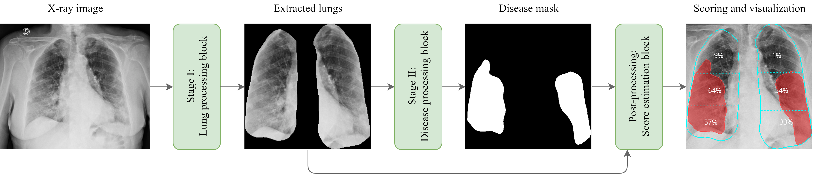
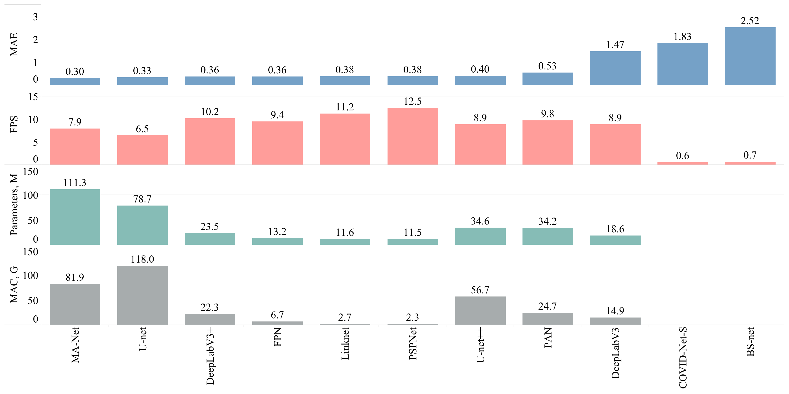

# Automatic scoring of COVID-19 severity in X-ray imaging based on a novel deep learning workflow

## 📖 Contents
- [Summary](#summary)
- [Contribution](#contribution)
- [Data](#data)
- [Methods](#methods)
- [Results](#results)
- [Conclusion](#conclusion)
- [Data Access](#data-access)
- [How to Cite](#how-to-cite)

## 🎯 Summary
In this project, we propose a two-stage workflow used for the segmentation and scoring of lung diseases. The workflow inherits quantification, qualification, and visual assessment of lung diseases on X-ray images estimated by radiologists and clinicians. It requires the fulfillment of two core stages devoted to lung and disease segmentation as well as an additional post-processing stage devoted to scoring. The latter integrated block is utilized, mainly, for the estimation of segment scores and computes the overall severity score of a patient. The models of the proposed workflow were trained and tested on four publicly available X-ray datasets of COVID-19 patients and two X-ray datasets of patients with no pulmonary pathology.  Based on a combined dataset consisting of 580 COVID-19 patients and 784 patients with no disorders, our best-performing algorithm is based on a combination of DeepLabV3+, for lung segmentation, and MA-Net, for disease segmentation. The proposed algorithms’ mean absolute error (MAE) of 0.30 is significantly reduced in comparison to established COVID-19 algorithms; BS-net and COVID-Net-S, possessing MAEs of 2.52 and 1.83 respectively. Moreover, the proposed two-stage workflow was not only more accurate but also computationally efficient, it was approximately 11 times faster than the mentioned methods. In summary, we proposed an accurate, time-efficient, and versatile approach for segmentation and scoring of lung diseases illustrated for COVID-19 and with broader future applications for pneumonia, tuberculosis, pneumothorax, amongst others.

## 📝 Contribution
To determine the most optimal workflow we evaluated nine state-of-the-art lung and disease segmentation networks and found the best performing configurations as determined by the combined accuracy and complexity. The latter is of particular importance as it allows the broader scientific community to adopt the determined hyper-parameters for further research, extending beyond the scope of this work. To study algorithm performance, we collected, cleaned, and pre-processed three lung segmentation datasets as well as four disease segmentation and scoring datasets acquired for COVID-19 and pneumonia-infected patients. The datasets are made publicly available ([Chest X-ray dataset for lung segmentation](https://data.mendeley.com/datasets/8gf9vpkhgy/1) and [Dataset for COVID-19 segmentation and severity scoring](https://data.mendeley.com/datasets/36fjrg9s69/1)). We compared our results against two known tailor-made solutions, [BS-net](https://www.sciencedirect.com/science/article/pii/S136184152100092X) and [COVID-Net-S](https://www.nature.com/articles/s41598-021-88538-4). The obtained [segmentation models ](https://github.com/quantori/prj-covid-scoring/tree/master/models) are also made publicly available on Git LFS.

## 📁 Data

In the proposed workflow, Stage I focuses on lung segmentation, where we curated and pre-processed three publicly available datasets: Darwin, Montgomery, and Shenzhen (<a href="#table-1">Table 1</a>). These datasets contain chest X-rays from patients diagnosed with COVID-19, pneumonia, or tuberculosis, serving as valuable resources for model training. Moving to Stage II, dedicated to disease segmentation and scoring, we collected and pre-processed four COVID-19 datasets, namely Actualmed COVID-19 Chest X-ray Dataset (ACCD), COVID-19 Radiography Database (CRD), COVID Chest X-Ray Dataset (CCXD), and Fig. 1 COVID Chest X-ray Dataset (FCXD) (<a href="#table-2">Table 2</a>). These datasets encompass CXRs from individuals diagnosed with COVID-19, sourced from over 40 medical institutions and hospitals. Additionally, to enhance network generalization, we included subjects with no pathological findings, ensuring a comprehensive training regime.

<i><strong id="table-1">Table 1.</strong> Description of the datasets used for lung segmentation</i>

|                                   **Dataset**                                   | **Training** | **Validation** | **Testing** |  **Total**  |
|:-------------------------------------------------------------------------------:|:------------:|:--------------:|:-----------:|:-----------:|
|    [Darwin](https://darwin.v7labs.com/v7-labs/covid-19-chest-x-ray-dataset)     |     4884     |      611       |     611     | 6106 / 90%  |
| [Montgomery](https://www.kaggle.com/raddar/tuberculosis-chest-xrays-montgomery) |     110      |       14       |     14      |  138 / 2%   |
|   [Shenzhen](https://www.kaggle.com/raddar/tuberculosis-chest-xrays-shenzhen)   |     452      |       57       |     57      |  566 / 8%   |
|                                      Total                                      |  5446 / 80%  |   682 / 10%    |  682 / 10%  | 6810 / 100% |

<i><strong id="table-2">Table 2.</strong> Description of the datasets used for COVID-19 segmentation and scoring</i>

|                                 **Dataset** 	                                 | **COVID-19** | **Normal**  | **Training** | **Validation**  | **Testing** |  **Total**  |
|:-----------------------------------------------------------------------------:|:------------:|:-----------:|:------------:|:---------------:|:-----------:|:-----------:|
|     [ACCD](https://github.com/agchung/Actualmed-COVID-chestxray-dataset)      |      49      |      0      |      39      |        5        |      5      |   49 / 4%   |
|   [CRD](https://www.kaggle.com/tawsifurrahman/covid19-radiography-database)   |     104      |      0      |      83      |       10        |     11      |  104 / 8%   |
|          [CCXD](https://github.com/ieee8023/covid-chestxray-dataset)          |     399      |      0      |     319      |       40        |     40      |  399 / 29%  |
|      [FCXD](https://github.com/agchung/Figure1-COVID-chestxray-dataset)       |      28      |      0      |      22      |        3        |      3      |   28 / 2%   |
| [CXN](https://www.kaggle.com/datasets/paultimothymooney/chest-xray-pneumonia) |      0       |     431     |     344      |       43        |     44      |  431 / 31%  |
|      [RSNA](https://www.kaggle.com/c/rsna-pneumonia-detection-challenge)      |      0       |     353     |     282      |       35        |     36      |  353 / 26%  |
|                                     Total                                     |  580 / 43%   |  784 / 57%  |  1089 / 80%  |    136 / 10%    |  139 / 10%  | 1364 / 100% |

## Methods

The proposed workflow inherits the quantification and qualification of lung diseases (scoring and decision-making) from expert radiologists, and fulfills the following processing steps, as shown in <a href="#figure-1">Figure 1</a>:
- Lung segmentation: pixel-level localization of the lungs and removal of unnecessary areas; 
- Disease segmentation: pixel-level localization of the infected area of the lungs; 
- Severity scoring: quantification and qualification of the infected area of the lungs.

  

    <em><strong>Figure 1.</strong> Schematic illustration of the proposed workflow.</em>

## Results

For the overall comparison of the proposed solutions, we showcase MAE estimated on the testing subset, the frame rate (FPS), the number of overall parameters, and MAC in <a href="#figure-2">Figure 2</a>. The Y-axes “Parameters” and “MAC” refer to the overall number of parameters and the theoretical amount of multiply-accumulate operations for both stages of the proposed workflow. Similar to the accuracy estimation, we choose DeepLabV3+ as the core network of Stage I. In Stage II we tested nine networks. All networks were tested in the evaluation mode meaning that (a) normalization or dropout layers work in evaluation mode instead of training; (b) the automatic differentiation engine is deactivated. Adoption of the evaluation mode reduces memory usage and speeds up computations turning the back-propagation over the network. The main GPU used for testing is NVIDIA RTX 2080 Ti 11 Gb. The best performance (12.5 images/s) resulted in a proposed pipeline consisting of DeepLabV3+ (Stage I) and PSPNet (Stage II) whilst ranking sixth by MAE of the severity score. The most accurate solution consisted of DeepLabV3+ (Stage I) and MA-Net (Stage II), ranking eighth in the level of performance (7.9 images/s). On the other hand, the prediction speed of the tailor-made solutions, BS-net and COVID-Net-S, turned out to be the lowest making up 0.7 and 0.6 images/s respectively.

  

    <em><strong>Figure 2.</strong> Overall comparison of the obtained solutions.</em>

|                                                  |                                        |                                               |
|:------------------------------------------------:|:--------------------------------------:|:---------------------------------------------:|
|                  |  |  |
|        (a) U-net   Severity score: 4         |  (b) U-net++   Severity score: 5   |     (c) DeepLabV3   Severity score: 0     |
|  |             |        |
|      (d) DeepLabV3+   Severity score: 3      |    (e) FPN   Severity score: 4     |      (f) Linknet   Severity score: 3      |
|              |             |              |
|        (g) PSPNet   Severity score: 3        |    (h) PAN   Severity score: 5     |      (i) MA-Net   Severity score: 5       |

    <em><strong>Figure 3.</strong> Comparison of the segmentation and severity score estimation of a COVID-19 subject from the ACCD dataset. A cyan delineation refers to the lung segmentation obtained by Stage I; a red mask is a disease mask obtained by Stage II; a yellow mask refers to the ground-truth segmentation of the disease.</em>

## 🏁 Conclusion

In this study, we present a workflow for scoring and segmenting lung diseases, inspired by clinical practices for assessing lung infections from X-ray images. Our approach involves two core stages: lung and disease mask generation, followed by severity score estimation. We evaluated nine neural networks and found DeepLabV3+ for lung segmentation and MA-Net for disease segmentation to be the most accurate. Compared to BS-net and COVID-Net-S, our approach offers greater stability and faster prediction times.

## 🔐 Data Access

All essential components of the study, including the curated dataset and trained models, have been made publicly available:
- Dataset for lung segmentation: [https://data.mendeley.com/datasets/8gf9vpkhgy/2](https://data.mendeley.com/datasets/8gf9vpkhgy/2).
- Dataset for COVID-19 segmentation and severity scoring: [https://data.mendeley.com/datasets/36fjrg9s69/1](https://data.mendeley.com/datasets/36fjrg9s69/1).
- Models: [https://zenodo.org/doi/10.5281/zenodo.8393555](https://zenodo.org/doi/10.5281/zenodo.8393555).

## 🖊️ How to Cite

Please cite [our paper](https://doi.org/10.1038/s41598-022-15013-z) if you found our data, methods, or results helpful for your research:

> Danilov V.V., Litmanovich D., Proutski A., Kirpich A., Nefaridze D., Karpovsky A., Gankin Y. (**2022**). _Automatic scoring of COVID-19 severity in X-ray imaging based on a novel deep learning workflow_. **Scientific Reports**, 12(1), 12791. DOI: [https://doi.org/10.1038/s41598-022-15013-z](https://doi.org/10.1038/s41598-022-15013-z)
